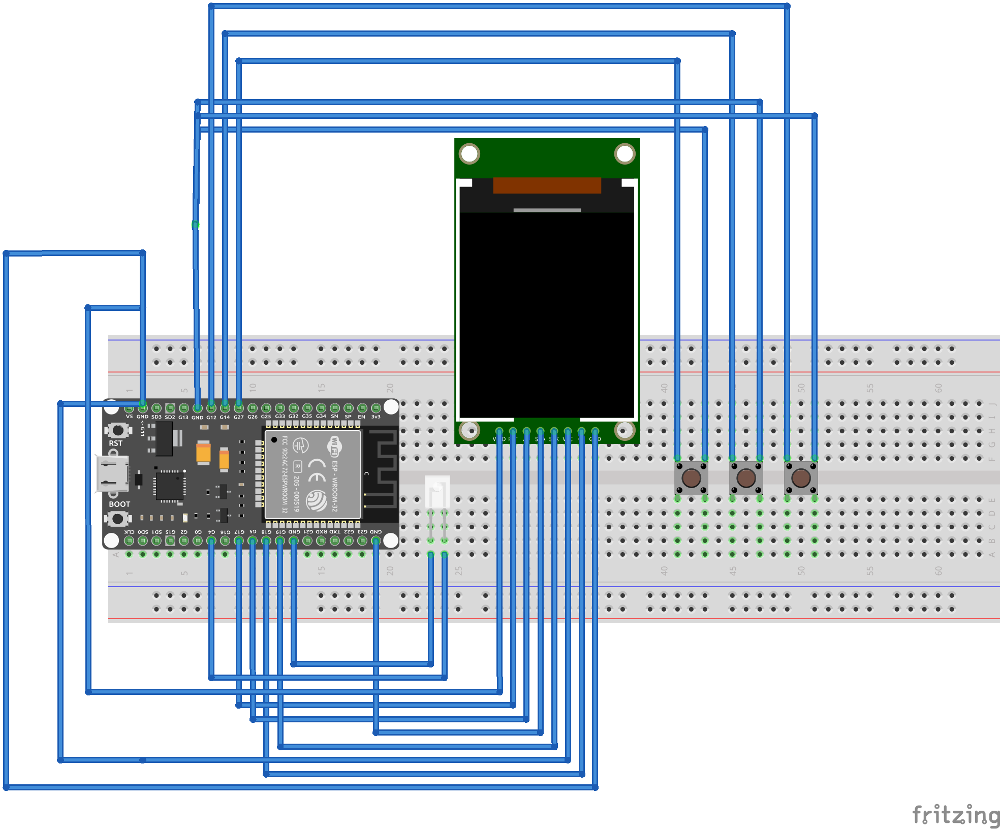

# 💎 Crypto Terminal Pro - Ultimate Edition

[](https://opensource.org/licenses/MIT)
[](https://www.espressif.com/en/products/socs/esp32)
[](https://github.com/rSepehr/esp32-crypto-terminal)
[]()

**Professional Real-Time Cryptocurrency Market Monitor**

*Transform your ESP32 into a powerful crypto trading terminal with advanced charting, portfolio tracking, and market analysis.*

[Features](#-features) • [Hardware](#-hardware-requirements) • [Usage](#-usage) • [Contributing](#-contributing)


---

## 📋 Table of Contents

- [Overview](#-overview)
- [Features](#-features)
- [Circuit Diagram](#-circuit-diagram)
- [Usage](#-usage)
- [API Reference](#-api-reference)
- [Troubleshooting](#-troubleshooting)
- [Acknowledgments](#-acknowledgments)

---

## 🎯 Overview

**Crypto Terminal Pro** is a professional-grade cryptocurrency market monitoring system built for ESP32 microcontrollers. It provides real-time price tracking, advanced charting capabilities, portfolio management, and comprehensive market analysis - all on a compact 1.8" TFT display.

### Why Crypto Terminal Pro?

- 🚀 **Real-time Updates**: Live cryptocurrency prices updated every 30 seconds
- 📊 **Advanced Charting**: Three chart types (Line, Area, Candle) with 40-point history
- 💼 **Portfolio Tracking**: Monitor your crypto holdings with P&L calculations
- 🔥 **Market Heatmap**: Visual representation of market movements
- 📈 **Trend Analysis**: Identify top gainers and losers instantly
- 🎨 **Cyberpunk UI**: Professional-grade interface with stunning visuals
- 🌐 **Free API**: Uses CoinGecko's free API - no API key required
- ⚡ **Production Ready**: Robust error handling and optimized performance

---

## ✨ Features

### 📊 Market Monitoring
- **15 Top Cryptocurrencies**: BTC, ETH, BNB, XRP, ADA, SOL, DOGE, MATIC, DOT, AVAX, LINK, UNI, ATOM, LTC, NEAR
- **Real-time Price Updates**: Automatic updates every 30 seconds
- **24h Change Tracking**: Visual indicators for price movements
- **Market Cap & Volume**: Comprehensive market statistics
- **Fear & Greed Index**: Market sentiment analysis
- **BTC Dominance**: Bitcoin market share tracking

### 📈 Advanced Charting
- **Three Chart Types**:
  - Line Chart: Clean trend visualization
  - Area Chart: Filled gradient display
  - Candle Chart: Professional trading view
- **40-Point History**: Extended price tracking
- **Auto-scaling**: Dynamic Y-axis adjustment
- **Grid Lines**: Professional chart formatting
- **Current Price Marker**: Highlighted latest price

### 💼 Portfolio Management
- **Holdings Tracking**: Monitor multiple positions
- **P&L Calculations**: Real-time profit/loss tracking
- **Buy Price Recording**: Track your entry points
- **Total Value Display**: Aggregate portfolio value
- **Percentage Gains**: Visual performance indicators

### 🔥 Market Analysis
- **Heatmap View**: 4x4 color-coded market grid
- **Trends View**: Top 5 gainers and losers
- **Market Sentiment Bar**: Gainers vs Losers visualization
- **Sorting Options**: Rank, Price, Change, Volume
- **Mini Charts**: Sparkline price history in lists

### 🎮 User Interface
- **6 View Modes**: Market, Detail, Portfolio, Heatmap, Trends, Splash
- **3-Button Control**: Intuitive navigation system
- **Cyberpunk Theme**: Professional color palette
- **Status Indicators**: WiFi, Update, and LED feedback
- **Smooth Animations**: Polished user experience
- **Scrollbar Navigation**: Easy list browsing

### 🔧 Technical Features
- **WiFi Auto-Connect**: Automatic reconnection handling
- **NTP Time Sync**: Accurate time display
- **Error Handling**: Robust exception management
- **Memory Optimization**: Efficient RAM usage
- **Data Validation**: Safe operations throughout
- **API Rate Limiting**: Respectful API usage
- **Timeout Protection**: No hanging requests

---


## 📐 Circuit Diagram

### Pin Configuration

```
ESP32-WROOM-32 Pin Mapping:
┌─────────────────────────────────────┐
│                                     │
│  LED Indicator:                     │
│    GPIO 4 ────[220Ω]───LED──GND    │
│                                     │
│  Control Buttons:                   │
│    GPIO 12 ────[Button]────GND      │  (SCROLL)
│    GPIO 14 ────[Button]────GND      │  (SELECT)
│    GPIO 27 ────[Button]────GND      │  (MODE)
│                                     │
│  TFT Display (ST7735):              │
│    GPIO 23 ──── MOSI                │
│    GPIO 18 ──── SCK                 │
│    GPIO 2  ──── CS                  │
│    GPIO 15 ──── DC                  │
│    GPIO 4  ──── RST                 │
│    3.3V    ──── VCC                 │
│    GND     ──── GND                 │
│    3.3V    ──── LED (Backlight)     │
│                                     │
└─────────────────────────────────────┘
```

### Schematic Diagram

```
                     ESP32-WROOM-32
                   ┌──────────────────┐
                   │                  │
    [Button SCROLL]│GPIO 12       VIN │────── 5V
           ├───────┤              GND │────── GND
          GND      │                  │
                   │   ┌───220Ω───┐   │
    [Button SELECT]│   │   LED    │   │
           ├───────┤GPIO 4      3.3V│──┼─── TFT VCC
          GND      │   └──────────┘   │
                   │                  │
    [Button MODE]  │GPIO 27  GPIO 23 │────── TFT MOSI
           ├───────┤         GPIO 18 │────── TFT SCK
          GND      │         GPIO 2  │────── TFT CS
                   │         GPIO 15 │────── TFT DC
                   │                  │
                   └──────────────────┘

Note: ESP32 has internal pull-ups, external resistors optional
```

### Breadboard Layout

```
     5V   GND   GPIO12  GPIO14  GPIO27  GPIO4
      │    │      │       │       │       │
      ├────┼──────┼───────┼───────┼───────┤
      │    │      │       │       │       │
   ┌──┴────┴──────┴───────┴───────┴───────┴──┐
   │                                          │
   │            ESP32-WROOM-32                │
   │                                          │
   └──┬───┬───┬────┬────┬────┬────┬────┬────┘
      │   │   │    │    │    │    │    │
     23  18  15   2   3.3V GND   │    │
      │   │   │    │    │    │   │    │
      │   │   │    │    │    │   │    │
   ┌──┴───┴───┴────┴────┴────┴───┴────┴────┐
   │         TFT Display ST7735             │
   │           128x160 pixels               │
   └─────────────────────────────────────────┘
```




---

## ⚙️ Configuration

### WiFi Settings

```cpp
const char* WIFI_SSID = "your_network_name";
const char* WIFI_PASSWORD = "your_password";
```

### Time Zone Configuration

```cpp
const long GMT_OFFSET = 12600;  // GMT+3:30 (Iran)
// For other time zones:
// GMT+0:  0
// GMT+1:  3600
// GMT+2:  7200
// GMT-5:  -18000
```

### Update Interval

```cpp
const unsigned long UPDATE_INTERVAL = 30000;  // 30 seconds (default)
// Recommended range: 15000-60000 (15-60 seconds)
```

### API Configuration

```cpp
const int API_TIMEOUT = 10000;  // 10 second timeout
const int WIFI_TIMEOUT = 30000; // 30 second timeout
```

### Customize Portfolio

Edit the portfolio array to track your holdings:

```cpp
PortfolioEntry portfolio[] = {
  {"BTC", 0.05, 40000},   // 0.05 BTC bought at $40,000
  {"ETH", 1.5, 2000},     // 1.5 ETH bought at $2,000
  {"SOL", 10, 100}        // 10 SOL bought at $100
};
```

### Customize Cryptocurrencies

To change tracked cryptocurrencies, edit the `cryptos` array:

```cpp
CryptoAsset cryptos[] = {
  {"BTC", "Bitcoin", "bitcoin", ...},
  {"ETH", "Ethereum", "ethereum", ...},
  // Add more coins here
};
```

Find coin IDs at: [CoinGecko API](https://www.coingecko.com/en/api)

---

## 🎮 Usage

Button Controls

SCROLL (Press): Navigate through list / Select next item
SELECT (Press): View details / Change chart type
MODE (Press): Switch view modes (Market → Portfolio → Heatmap → Trends → Market)
### View Modes

#### 1. 📊 Market View (Default)
- **Display**: List of 15 cryptocurrencies with mini charts
- **Information**: Rank, Symbol, Price, 24h Change
- **Features**: Market cap, Fear & Greed Index, BTC Dominance
- **Navigation**: Use SCROLL to browse, SELECT to view details

#### 2. 📈 Detail View
- **Display**: Detailed chart and statistics for selected coin
- **Information**: Current price, High/Low 24h, Volume, Market Cap
- **Chart Types**: Line, Area, Candle (toggle with SELECT)
- **Navigation**: SELECT cycles through chart types, MODE returns to market

#### 3. 💼 Portfolio View
- **Display**: Your crypto holdings and total value
- **Information**: Amount, Current Value, P&L per coin
- **Features**: Total portfolio value, Overall P&L percentage
- **Navigation**: MODE to switch views

#### 4. 🔥 Heatmap View
- **Display**: 4x4 color-coded grid of top 16 cryptos
- **Color Coding**:
  - 🟢 Bright Green: >10% gain
  - 🟢 Green: 5-10% gain
  - 🟢 Light Green: 0-5% gain
  - 🔴 Light Red: 0-5% loss
  - 🔴 Red: 5-10% loss
  - 🔴 Dark Red: >10% loss
- **Navigation**: Visual overview, MODE to continue

#### 5. 📊 Trends View
- **Display**: Top 5 gainers and top 5 losers
- **Features**: Market sentiment bar (gainers vs losers)
- **Information**: Ranking, Symbol, Percentage change
- **Navigation**: MODE to cycle through views

###LED Indicators

Single blink: Button pressed
Triple blink: System starting
Steady ON: API request in progress
OFF: Normal operation

###Status Indicators

Top right dot – Green (🟢): WiFi connected
Top right dot – Red (🔴): WiFi disconnected
Flash – Gold (🟡): Data updating

## 🔌 API Reference

### CoinGecko API

This project uses the [CoinGecko API](https://www.coingecko.com/en/api) (Free tier, no API key required).

**Endpoint Used:**
```
https://api.coingecko.com/api/v3/simple/price
```

**Parameters:**
- `ids`: Comma-separated cryptocurrency IDs
- `vs_currencies`: usd
- `include_24hr_change`: true
- `include_24hr_vol`: true
- `include_market_cap`: true

**Rate Limits:**
- Free tier: 10-50 calls/minute
- This project: 2 calls/minute (safe)

**Example Response:**
```json
{
  "bitcoin": {
    "usd": 45000,
    "usd_24h_change": 2.5,
    "usd_24h_vol": 25000000000,
    "usd_market_cap": 850000000000
  }
}
```

### Supported Cryptocurrencies

1. Bitcoin (BTC)
2. Ethereum (ETH)
3. Binance Coin (BNB)
4. Ripple (XRP)
5. Cardano (ADA)
6. Solana (SOL)
7. Dogecoin (DOGE)
8. Polygon (MATIC)
9. Polkadot (DOT)
10. Avalanche (AVAX)
11. Chainlink (LINK)
12. Uniswap (UNI)
13. Cosmos (ATOM)
14. Litecoin (LTC)
15. Near Protocol (NEAR)


## 🔧 Troubleshooting

### Display Issues

**Problem**: Display shows nothing / white screen
- ✅ Check TFT_eSPI configuration in `User_Setup.h`
- ✅ Verify all display pins are connected correctly
- ✅ Try swapping `TFT_RGB_ORDER` to `TFT_RGB` or `TFT_BGR`
- ✅ Check display voltage (3.3V not 5V)

**Problem**: Colors are inverted/wrong
- ✅ Change `#define TFT_RGB_ORDER` in `User_Setup.h`
- ✅ Try both `TFT_RGB` and `TFT_BGR` settings

**Problem**: Display orientation is wrong
- ✅ Adjust `tft.setRotation(1)` value (0-3)

### WiFi Issues

**Problem**: Cannot connect to WiFi
- ✅ Double-check SSID and password
- ✅ Ensure 2.4GHz WiFi (ESP32 doesn't support 5GHz)
- ✅ Check WiFi signal strength
- ✅ Verify firewall settings

**Problem**: WiFi keeps disconnecting
- ✅ Move closer to router
- ✅ Check for WiFi interference
- ✅ Update ESP32 core library

### API Issues

**Problem**: No data loading / API timeout
- ✅ Check internet connection
- ✅ Verify CoinGecko API is accessible
- ✅ Increase `API_TIMEOUT` value
- ✅ Check serial monitor for error messages

**Problem**: Some coins not updating
- ✅ Verify coin IDs match CoinGecko IDs
- ✅ Check API rate limits
- ✅ Wait a few minutes and retry

### Hardware Issues

**Problem**: Buttons not responding
- ✅ Check button connections to GND
- ✅ Verify GPIO pins match code
- ✅ Test buttons with multimeter
- ✅ Check for loose connections

**Problem**: LED not blinking
- ✅ Verify LED polarity (long leg = positive)
- ✅ Check 220Ω resistor is in place
- ✅ Test LED separately

### Compilation Errors

**Problem**: `TFT_eSPI.h: No such file`
- ✅ Install TFT_eSPI library via Library Manager

**Problem**: `ArduinoJson.h: No such file`
- ✅ Install ArduinoJson library (version 6.x)

**Problem**: ESP32 board not found
- ✅ Install ESP32 board support package
- ✅ Restart Arduino IDE

### Serial Monitor Debugging

Enable serial debugging to diagnose issues:

```cpp
Serial.begin(115200);
```

Expected output:
```
╔════════════════════════════════════╗
║  CRYPTO TERMINAL PRO - v3.0        ║
╚════════════════════════════════════╝

✓ Hardware initialized
✓ Display initialized (160x128)
→ Connecting to WiFi........
✓ WiFi connected successfully
   IP: 192.168.1.100
✓ Initial data loaded
✓ System ready
```


---

## 🙏 Acknowledgments

### Libraries & APIs
- [TFT_eSPI](https://github.com/Bodmer/TFT_eSPI) by Bodmer - Excellent TFT library
- [ArduinoJson](https://arduinojson.org/) by Benoît Blanchon - JSON parsing
- [CoinGecko API](https://www.coingecko.com/en/api) - Free cryptocurrency data
- [ESP32 Arduino Core](https://github.com/espressif/arduino-esp32) by Espressif

### Inspiration
- Bloomberg Terminal UI design
- TradingView chart aesthetics
- Cyberpunk 2077 visual style

### Community
- Arduino community for support
- ESP32 developers for documentation
- GitHub community for open source collaboration

---

## 📬 Contact & Support

### Author
**Sepehr Zahedi Abghari**
- GitHub: [@rSepehr](https://github.com/rSepehr)
- Email: sepehr.zahede@gmail.com
- LinkedIn: [Sepehr Zahedi Abghari](https://linkedin.com/in/rSepehr)


### Support the Project

If you find this project useful, please consider:
- ⭐ Starring the repository
- 🐛 Reporting bugs
- 💡 Suggesting new features
- 📢 Sharing with others

---


### ⭐ Star this repository if you found it helpful!

**Made with ❤️ for the crypto community**


---

*Last Updated: December 2025*
